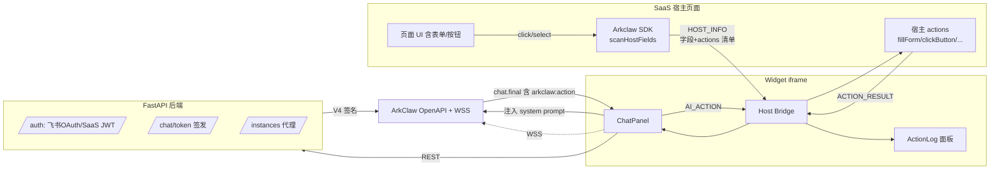

# ArkClaw → SaaS Widget

把 ArkClaw 智能体封装成可嵌入任意 SaaS 工具的对话 Widget。用户既能在抽屉里和 AI 自然语言对话，也能让 **AI 反向控制宿主页面**（填表、点按钮、跳转、高亮）。

> **Copilot 风格**：不只是 chatbot，更是 SaaS 内嵌的 AI 协作伙伴。

**最近更新（2026-04）**：

- AI 现在能自动"看见"宿主页面有哪些字段、按钮和注册的 actions（widget 自动扫描后通过 `HOST_INFO` 推送给 AI），AI 直接生成 `<arkclaw:action>` 标签即可填表，**无需开发者自己写"工具描述" prompt**
- 强约束身份注入，避免 AI 跑去用浏览/搜索工具瞎找页面
- 抽屉里加"已执行动作"可视化面板，调试 AI → 宿主链路一目了然
- Session 跨刷新持久化（解决了 srcdoc iframe 的 localStorage 隔离问题）
- 4 种 AI 输出格式都能解析：XML 标签 / markdown json / JSON 数组 / OpenAI tool_call
- 离线回归测试脚本：`scripts/verify-action-pipeline.mjs`

## 项目架构

```
arkclaw-to-saas/
├── backend/                # FastAPI 后端：飞书 OAuth + SaaS JWT 双认证 + ChatToken 签发
│   ├── app/
│   │   ├── main.py         # FastAPI 入口
│   │   ├── api/            # auth.py / chat.py / instances.py
│   │   ├── services/       # arkclaw / lark / jwt / volc_sign
│   │   ├── core/           # 配置、安全
│   │   └── schemas/        # Pydantic 模型
│   ├── Dockerfile
│   └── requirements.txt
│
├── widget/                 # 前端 Widget：React + Vite + TypeScript
│   ├── src/
│   │   ├── components/     # ChatPanel / MessageList / InputBar / SelectionToolbar / ...
│   │   ├── hooks/          # useWebSocket / useHostBridge
│   │   ├── sdk/            # Arkclaw 主类 + HostBridge + utils
│   │   ├── store/          # Zustand chat 状态
│   │   ├── api/            # 后端 REST 客户端
│   │   └── styles/         # 主题 CSS variables
│   ├── examples/
│   │   ├── vanilla-html/   # <script> 引入接入示例
│   │   ├── react-app/      # React + Vite 接入
│   │   └── nextjs/         # Next.js (App Router) 接入
│   └── Dockerfile          # 用 nginx 托管 dist + examples
│
├── demo/                   # 旧的 CLI/HTML demo（保留作参考）
├── docker-compose.yml      # 一键启动 backend + widget
└── .env.example
```



## 核心能力

| 能力 | 描述 |
|------|------|
| 自然语言对话 | 流式回复 + 思考过程展示 + 媒体预览 |
| **AI 自动认识页面** | widget 自动扫描 `input/select/textarea/button` 的 `name/label/options`，连同你注册的 actions 一起推给 AI（无需自己写工具描述 prompt） |
| **AI 反向操作** | AI 输出 `<arkclaw:action>` 标签即可调用宿主 actions（填表、点击、跳转、高亮） |
| **多格式 action 解析** | XML 标签 / markdown json 块 / JSON 数组 / OpenAI tool_call 都能解析，一次回复多个 action 顺序执行 |
| **强约束身份注入** | Prompt 明确告诉 AI 它嵌入在用户当前页面里，禁止跑去用浏览/搜索工具瞎找页面 |
| **ActionLog 可视化** | 抽屉里折叠面板显示 AI 调了什么 action / 参数 / `✓ ok` `✗ error` / 返回值，调试链路一目了然 |
| 上下文捕获 | 用户点击宿主元素 / 划词，自动作为上下文推送给 AI |
| 划词工具栏 | 在 widget 内对消息划词，弹出 "问 AI / 总结 / 翻译" |
| 高亮回示 | AI 提到的元素可通过 `<arkclaw:action name="highlight">` 自动高亮+滚动 |
| **Session 持久化** | localStorage 同步存储 session，跨刷新不掉登录（解决 srcdoc iframe 隔离问题） |
| 双认证 | 飞书 OAuth（内部）+ SaaS JWT（外部 SaaS 集成） |
| 样式隔离 | iframe 模式天然隔离；inline 模式用 Shadow DOM 隔离 |
| 单文件分发 | Vite lib mode 输出 UMD bundle，`<script>` 即可引入 |
| 多实例切换 | header 内置 InstancePicker，可在多个 ClawInstance 间无刷切换 |

## 快速开始

### 1. 准备环境变量

```bash
cp .env.example .env
# 编辑 .env，填入 VOLC_ACCESS_KEY_ID / SECRET / SPACE_ID / LARK_APP_ID 等
```

### 2. 一键启动（推荐）

需要 Docker：

```bash
docker compose up --build
```

- 后端：http://127.0.0.1:8000 （Swagger: `/docs`）
- Widget 演示：http://127.0.0.1:8080

### 3. 本地开发模式

后端：

```bash
cd backend
pip install -r requirements.txt
uvicorn app.main:app --reload --port 8000
```

前端 Widget：

```bash
cd widget
npm install
npm run dev          # 开发模式（http://127.0.0.1:5173）
npm run build        # 输出 dist/arkclaw-widget.umd.js
```

集成示例：

```bash
cd widget/examples/vanilla-html && python3 -m http.server 5500
cd widget/examples/react-app && npm install && npm run dev
cd widget/examples/nextjs && npm install && npm run dev
```

## SaaS 集成方式

### 方式 1：UMD Script（最简）

```html
<script src="https://your-cdn/arkclaw-widget.umd.js"></script>
<script>
  const claw = new window.Arkclaw.Arkclaw({
    endpoint: 'https://your-backend.com',
    auth: { type: 'jwt', token: '<SaaS 签发的 JWT>' },
    ui: { mode: 'side-drawer', defaultOpen: false },
    context: { captureClicks: true, captureSelection: true },
    actions: {
      fillForm: ({ field, value }) => { /* 你的表单逻辑 */ },
      navigate: ({ url }) => location.assign(url),
    },
  });
  claw.mount();
</script>
```

### 方式 2：NPM 包（React/Vue/Next）

```bash
npm install @arkclaw/widget
```

```ts
import { Arkclaw } from '@arkclaw/widget';

const claw = new Arkclaw({ /* 同上 */ });
claw.mount();
claw.send('总结当前页面');
claw.on('action', console.log);
```

详细示例见 [`widget/examples/`](widget/examples/)。

## SDK API 概览

```ts
class Arkclaw {
  constructor(opts: ArkclawOptions);

  mount(target?: HTMLElement | string): void;   // 默认 document.body
  unmount(): void;
  open(): void;
  close(): void;
  toggle(): void;
  send(text: string, meta?: object): Promise<void>;

  registerAction(name: string, handler: ActionHandler): void;
  unregisterAction(name: string): void;
  pushContext(opts: { trigger?, element?, selection?, extra? }): void;

  on('message' | 'open' | 'close' | 'action' | 'highlight' | 'state-change' | 'error', fn): () => void;
}
```

完整类型定义在 [`widget/src/sdk/types.ts`](widget/src/sdk/types.ts)。

## 双向通信协议

宿主 SDK 与 Widget 之间通过 `postMessage` 通信，所有消息都带 `__arkclaw__: true` 信封。

| 方向 | 类型 | 用途 |
|------|------|------|
| Host → Widget | `OPEN` / `CLOSE` / `TOGGLE` | 控制面板开合 |
| Host → Widget | `SEND` | 主动发问 |
| Host → Widget | `HOST_CONTEXT` | 推送页面上下文（点击/划词） |
| Host → Widget | `ACTION_RESULT` | 回传 AI 调用动作的执行结果 |
| Widget → Host | `READY` / `STATE` | 就绪和状态广播 |
| Widget → Host | `MESSAGE` | 用户/AI 消息广播（埋点用） |
| Widget → Host | `AI_ACTION` | AI 请求宿主执行动作 |
| Widget → Host | `HIGHLIGHT` | 高亮某个 selector |
| Widget → Host | `NEED_AUTH` | 需要重新授权 |

详见 [`widget/src/sdk/types.ts`](widget/src/sdk/types.ts) 的 `BridgeFromHost` / `BridgeFromWidget`。

## AI 怎么"看见"你的页面

**这套设计的核心**：你不需要自己写"工具描述" prompt 告诉 AI 页面有什么，widget 自动做：

1. `Arkclaw.mount()` 时扫描宿主页面所有 `input / select / textarea / button`，抽取 `name / label / placeholder / options / type`
2. 收集所有你在 `actions: {}` 里注册的动作名
3. 通过 `HOST_INFO` postMessage 推给 widget；SPA 切路由后调 `claw.refreshHostInfo()` 重扫
4. ChatPanel 在用户首次发问时，把这堆信息渲染成结构化 system prompt 注入给 AI（强约束："你嵌在这个页面里，不要去搜索/打开 URL"）
5. 后续每条用户消息附带短提醒，避免 AI 在多轮对话中"忘了"身份

只要给你的 `<input>` 加上有意义的 `name="title"` 和 `<label for="title">报销标题</label>`，AI 就知道"标题填4月差旅"该用 `fillForm` 调哪个字段。

## AI Action 协议

让 AI 触发宿主动作的格式（widget 都能解析）：

| 格式 | 示例 | 适用场景 |
|---|---|---|
| **XML 标签**（推荐） | `<arkclaw:action name="fillForm">{"field":"amount","value":100}</arkclaw:action>` | 大多数 LLM 都能稳定输出 |
| markdown json 块 | <code>\`\`\`json\n{"action":"fillForm","args":{...}}\n\`\`\`</code> | 豆包/通义默认偏好这种 |
| markdown json 数组 | 一个块里 `[{...}, {...}]` | AI 想一次发多个动作 |
| OpenAI tool_call | `chat.message.content[i].type === 'tool_call'` | ArkClaw Agent 配了原生 function calling |

一次回复中多个 action **顺序执行**，每个的结果通过 `ACTION_RESULT` 回传给 widget，再由 widget 作为系统消息发回 AI 形成闭环（AI 可以根据上一个动作的结果决定下一步）。

宿主端注册（最简版）：

```ts
new Arkclaw({
  actions: {
    fillForm: async ({ field, value }) => {
      document.querySelector(`[name="${field}"]`).value = value;
      return { ok: true };  // 或 { ok: false, reason: '...' }
    },
  },
});
```

⚠️ **React/Vue 受控组件**：dispatchEvent 无效，必须用 setState/v-model。详见 [`widget/README.md` 受控章节](widget/README.md#受控组件-vs-非受控组件) 和 [`widget/examples/react-app/`](widget/examples/react-app/)。

## 调试与可视化

抽屉输入框上方会自动出现「已执行动作」折叠面板（有调用时才显示）：

- 列出 AI 触发的每个 action：动作名 + 参数 JSON
- 三种状态实时切换：`…pending` → `✓ ok` 或 `✗ error`
- 点开看你 action handler 的返回值或错误信息

不用再 console 翻 `[Arkclaw][chat-event]` 日志，遇到"AI 没填上"立刻能判断是哪一环出问题：

| 现象 | 问题在 |
|---|---|
| 面板没出现 | AI 根本没生成 action（prompt 没压住或 Agent 系统词太强势） |
| `pending` 一直不变 | 宿主 runAction 没回 ACTION_RESULT，是 SDK 链路问题 |
| `✗ error` | 字段名/参数错，错误信息写明 |
| `✓ ok` 但页面没变化 | fillForm 实现层问题（受控组件没用 setState？） |

## 离线回归测试

```bash
docker run --rm -v $PWD/widget:/w -w /w node:20-alpine \
  node scripts/verify-action-pipeline.mjs
```

覆盖 6 个场景：标准 XML 标签 / markdown json 块 / JSON 数组 / OpenAI tool_call / 闲聊不误触发 / 流式半成品不误触发。改 `tryParseActions` 或 `buildHostCapabilityPrompt` 后跑一下确保兼容性没破。

## 安全考虑

1. **AK/SK 不下发前端**：后端用 V4 签名调用 ArkClaw OpenAPI，只把 `ChatToken + ws_url` 给前端。
2. **Session JWT TTL 较短**：默认 24h，过期需重新走 OAuth/SaaS 验证。
3. **CORS 严格控制**：生产环境 `CORS_ORIGINS` 不要用 `*`，写死 SaaS 域名。
4. **postMessage origin 校验**：`HostBridge` 默认接受所有 origin（方便开发），生产建议传具体 origin。
5. **Action 白名单**：只暴露安全的 SaaS 操作，不要把 `eval`、任意 fetch 等危险能力暴露给 AI。
6. **划词/点击采集 selectorsBlacklist**：屏蔽密码框等敏感字段。

## 开发路线图

- [x] 多实例选择器（用户在多个 ClawInstance 之间切换）
- [x] AI 自动了解页面字段（HOST_INFO 推送 + prompt 注入）
- [x] AI 触发宿主动作可视化（ActionLog 面板）
- [x] Session 跨刷新持久化
- [x] 多格式 action 解析（XML/markdown json/tool_call）
- [ ] 消息持久化（IndexedDB / 后端 history API）
- [ ] 文件上传（图片/PDF）
- [ ] 主题市场（自定义 CSS variables 集合）
- [ ] 国际化（i18n）
- [ ] 抽屉里加"退出登录"按钮，手动清 session

## 旧版 demo

`demo/` 目录保留了原始的纯 Python + HTML 演示，作为协议参考与最小可运行原型：

- `demo/main.py`：CLI 交互式聊天（用于快速验证后端凭证）
- `demo/web_demo.py`：旧的单文件 HTTP/HTML 演示

新项目以 `backend/` + `widget/` 为准。

## License

MIT
